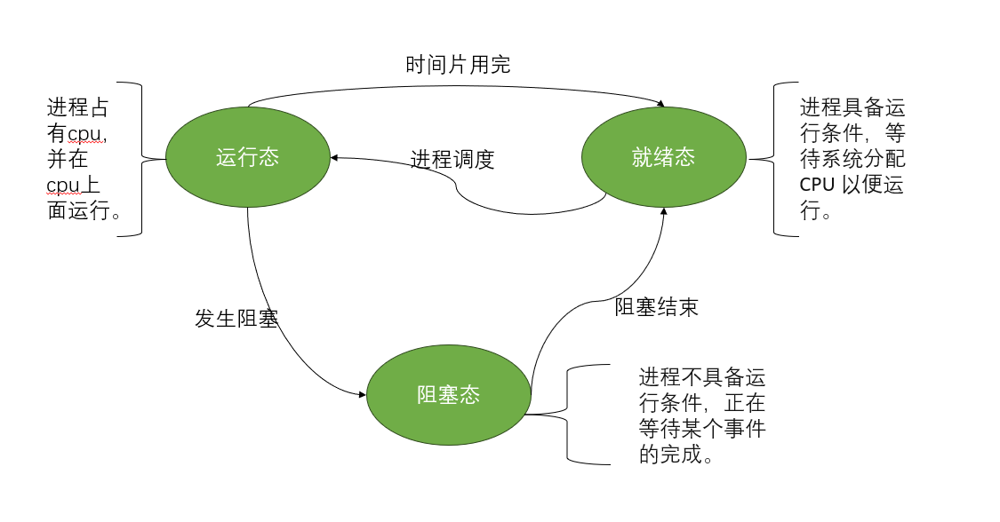
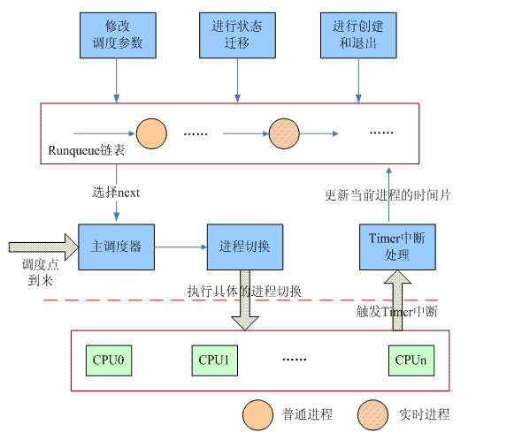

# 进程调度源码分析

## 为什么有进程调度
当 CPU 有一堆任务要处理时，由于其资源有限，这些事情就没法同时处理。这就需要确定某种规则来决定处理这些任务的顺序完成资源的分配，实现多任务并发执行，由此我们要完成进程之间的状态就需要引入调度，调度又分为作业调度、内存调度、进程调度等，本次我们主要探讨进程调度。

**进程的状态及其转换**


我们主观的可以看出，从运行态到阻塞态的切换过程是由于发生了阻塞事件，那么进程就会挂起，不会产生进程调度；当阻塞事件结束后，当前进程为了获得有效输入就会转入到就绪态；运行态到就绪的切换过程是当前进程已经拥有了除了cpu之外的其他全部资源，所以会产生进程调度等待cpu；就绪态当前获得cpu就会转入运行态。所以说进程调度实质就是多个进程就绪等待cpu分配运行，cpu会按一定的调度算法从就绪队列中选择一个进程，把cpu的使用权交给被选中的进程。产生阶段只存在于运行态与就绪态之间，如果没有就绪进程，系统会安排一个系统空闲进程或idle进程进入cpu运行，以达到实现进程的并发执行，这样通过借助调度程序，多任务操作系统就可以极大提高cpu的利用率。

## O(N)调度
### 算法思想 
任务调度器：2.4.18版本

(1) 任务调度器将普通进程与实时进程的的运行状态挂载到Runqueue全局链表上面，所有cpu共享该链表，当前的进程会不断的进行创建、修改调度参数、删除等操作。

(2) 当fork进程创建的时候，子进程就会被挂载到当前runqueue链表，发生阻塞或者退出时，进程就会从当前链表中删除，利用next算法选择优先级较高的调用schedule函数进行进程之间的切换。

(3) schedule函数遍历队列中的进程，选取时间片最多的，作为下一个放在CPU上跑的进程。完成cpu的调度。

(4) 在此过程中需要用到task链表，当所有进程的时间片都用光，内核就会遍历所有的task，重新计算每个task的时间片，然后开始下一轮调度。

(5) 主调度器在选择task时需要加spinlock锁，所以需要寻找时间片最多的task并且在此过程中需要一直运行，所以需要遍历队列的所有task即遍历整个链表，所以时间复杂度为O(n)。

为了选取next task，调度器需要一定的信息所以查看task_struct结构体获取必要字段信息

```c
struct task_struct {
volatile long need_resched;
long counter;//时间片
//counter就是该进程分配的CPU时间额度，单位为tick时钟滴答，一次tick那么count就会减1，直到count=0，等待下一个调度周期开始
long nice;//普通进程静态优先级
//通过NICE_TO_TICKS宏可以将一个进程的静态优先级映射成缺省时间片并保存在counter成员中，范围大小-20-19整数内，数值越大优先级越低
unsigned long policy;
int processor;//进程正在执行的逻辑cpu号
unsigned long cpus_runnable, cpus_allowed;//cpus_allowed是该task允许在那些CPU上执行的掩码，cpus_runnable计算一个指定的进程是否适合调度到指定的CPU上去执行，如果没有被cpu执行，所有的bit被设定为1，如果正在被CPU执行，将正在执行的CPU bit设定为1，其他设定为0。
struct list_head run_list;
unsigned long rt_priority;//实时进程静态优先级
//决定实时进程在一个调度周期内被执行顺序，优先级越大，越会被优先执行，分为时间片来轮转调度（SCHED_RR）以及一种是先到先得（SCHED_FIFO）
......};
```

选取task流程：

静态优先级就是task固有的优先级不会随便发生改变，在调度的过程中实际用到的是动态优先级，动态优先级最大的task将会越容易运行，在计算动态优先级可以分为实时进程以及普通进程。

#### 普通进程

```c
static inline int goodness(struct task_struct * p, int this_cpu, struct mm_struct *this_mm)// goodness()函数衡量处于可运行状态的进程
{
	......
	/*
	 * Non-RT process - normal case first.
	 */
	if (p->policy == SCHED_OTHER) {							//普通进程
		weight = p->counter;							//取出时间片
		if (!weight)										//当前时间片用完
			goto out;

		weight += 20 - p->nice;							//进程时间片+静态优先级=动态优先级
        //NICE = 20 - p->nice
		//weight = p->counter + NICE
        //
		goto out;
	}	
    	weight = 1000 + p->rt_priority;		
}
```
### 实时进程：

```c
weight = 1000 + p->rt_priority//静态优先级＋固定偏移量 
```

显然weight值只与静态优先级有关，优先级较高的先执行，对于实时进程又分为SCHED_RR时间片轮转实时进程(优先级相同的两个进程轮流被调度)以及SCHED_FIFO先到先得实时进程(优先级相同的进程，先被遍历到的进程会先执行，下一次仍然是它，直到结束)

SCHED_RR时间片轮转实时进程

```C
asmlinkage void schedule(void) {
	......
	/* move an exhausted RR process to be last.. */
	if (prev->policy == SCHED_RR)		//	时间片轮转进程				
		goto move_rr_last;				
move_rr_back:
	......
move_rr_last://检查时间片是否耗尽
	if (!prev->counter) {//时间片耗尽									
		prev->counter = NICE_TO_TICKS(prev->nice);//将静态优先级转化成时间片
		move_last_runqueue(prev);//移动到运行队列末端
	}
	goto move_rr_back;
	......
}
//拥有时间片，一旦被运行队列中选中投入运行，会一直运行下去，只有优先级比它高的实时进程才能打断它，这样在优先级相等的SCHED_RR在遍历runqueue链表的时候会命中链表中的第一个task，从而实现时间片轮转
```

### 具体实现

```c
asmlinkage void schedule(void)
{
	struct schedule_data * sched_data;//定义一个指向schedule_data结构体的指针，这个结构体包含调度相关的数据
	struct task_struct *prev, *next, *p;//prev调度之前的进程，next调度之后的进程
	struct list_head *tmp;//临时指针指向双向链表
	int this_cpu, c;//this_cpu用于存储当前CPU的编号，c可能用于临时存储某个整型值  

	if (!current->active_mm) BUG();//当前进程的active_mm为空，则出错

need_resched_back://记录当前进程以及处理此进程的cpu号
	prev = current;//prev成为当前进程
	this_cpu = prev->processor;//获取当前进程的CPU编号  

	if (in_interrupt())//schedule中断服务程序中内部执行，发生错误
		goto scheduling_in_interrupt;
	
	release_kernel_lock(prev, this_cpu);//释放全局锁这允许其他CPU上的进程运行  
	
	/* Do "administrative" work here while we don't hold any locks */
	if (softirq_active(this_cpu) & softirq_mask(this_cpu))//  如果当前CPU有软中断需要处理  
 goto handle_softirq; // 则跳转到handle_softirq标签处处理  
  
handle_softirq_back:   
sched_data = & aligned_data[this_cpu].schedule_data; // 获取当前CPU的调度数据  
  
spin_lock_irq(&runqueue_lock); // 获取自旋锁，这可以防止其他进程同时访问runqueue

		goto handle_softirq;// 则跳转到handle_softirq标签处处理  
	/* move an exhausted RR process to be last.. *///如果前一个进程是循环调度（RR）策略，且已经用尽时间片  
    
    handle_softirq_back:  
    sched_data = & aligned_data[this_cpu].schedule_data; // 获取当前CPU的调度数据  
    spin_lock_irq(&runqueue_lock);//过获取自旋锁来保证对运行队列操作的原子性  
	if (prev->policy == SCHED_RR)//SCHED_RR表示循环调度策略 
		goto move_rr_last;//跳转到move_rr_last标签，实时进程放于队列末尾
move_rr_back:
	switch (prev->state){// 根据前一个进程的状态进行处理  
		case TASK_INTERRUPTIBLE://进程可被信号中断
			if (signal_pending(prev)) {//如果进程处于可中断等待状态
				prev->state = TASK_RUNNING;//则将进程状态设为运行态，表示它可以重新获得CPU 
				break;
			}
		default://中断等待/僵死状态则从运行队列中删除
			del_from_runqueue(prev);
		case TASK_RUNNING://可运行状态继续处理
	}
	prev->need_resched = 0;//将前一个进程的need_resched字段设为0，表示它不需要重新调度

//调度程序
repeat_schedule://表示调度程序的某个重复或循环部分  

	next = idle_task(this_cpu);// 默认选择当前CPU的空闲任务作为下一个要运行的任务。如果没有其他可运行的任务，系统会运行空闲任务。  
	c = -1000;
	if (prev->state == TASK_RUNNING)//检查前一个任务（prev）的状态，如果它仍然在运行（TASK_RUNNING状态）  
		goto still_running;// 如果前一个任务仍在运行，跳转到still_running标签处继续处理，以避免重复调度同一个任务。
   
still_running_back:
	list_for_each(tmp, &runqueue_head) //遍历运行队列
	{	p = list_entry(tmp, struct task_struct, run_list);//从临时指针tmp获取实际的task_struct结构体指针，将其赋值给p
		if (can_schedule(p, this_cpu)) //检查任务p是否可以在当前CPU上调度，如果可以调度，继续下面的逻辑  
			int weight = goodness(p, this_cpu, prev->active_mm);//// 调用goodness函数获取任务p在当前CPU上的权重值  
			if (weight > c)
            {
                c = weight; // 更新最大权重值  
                next = p; // 更新最优任务指针 
            }
		}
	}

	/* Do we need to re-calculate counters? */
	if (!c)//c=0当前运行队列中所有进程权值=0即各进程时间片已用完
		goto recalculate;
	/*
	 * from this point on nothing can prevent us from
	 * switching to the next task, save this fact in
	 * sched_data.
	 */
	sched_data->curr = next;//将选中的下一个任务设置为当前任务 

#ifdef CONFIG_SMP// 如果定义了CONFIG_SMP（多处理器配置） 
 	next->has_cpu = 1;//标记下一个任务已经分配到CPU  
	next->processor = this_cpu;//设置下一个任务要运行的CPU编号  
#endif
	spin_unlock_irq(&runqueue_lock);//锁住运行队列

	if (prev == next)//选中进程为原来进程
		goto same_process;//跳转到same_process标签处处理

#ifdef CONFIG_SMP
 	/*
 	 * maintain the per-process 'last schedule' value.
 	 * (this has to be recalculated even if we reschedule to
 	 * the same process) Currently this is only used on SMP,
	 * and it's approximate, so we do not have to maintain
	 * it while holding the runqueue spinlock.
 	 */
 	sched_data->last_schedule = get_cycles();

	/*
	 * We drop the scheduler lock early (it's a global spinlock),
	 * thus we have to lock the previous process from getting
	 * rescheduled during switch_to().
	 */

#endif /* CONFIG_SMP */

	kstat.context_swtch++;//统计上下文切换次数
	/*
	 * there are 3 processes which are affected by a context switch:
	 *
	 * prev == .... ==> (last => next)
	 *
	 * It's the 'much more previous' 'prev' that is on next's stack,
	 * but prev is set to (the just run) 'last' process by switch_to().
	 * This might sound slightly confusing but makes tons of sense.
	 */
// 准备进行地址空间的切换  
prepare_to_switch();  
{  
    // 获取下一个进程的地址空间描述符  
    struct mm_struct *mm = next->mm;  
    // 获取前一个进程当前活动的地址空间描述符  
    struct mm_struct *oldmm = prev->active_mm;  
  
    if (!mm) { // 如果下一个进程没有自己的地址空间（通常是内核线程）  
        // 如果下一个进程已经有活动的地址空间，则出现错误  
        if (next->active_mm) BUG();  
        // 将前一个进程的活动地址空间赋给下一个进程  
        next->active_mm = oldmm;  
        // 增加地址空间描述符的引用计数  
        atomic_inc(&oldmm->mm_count);  
        // 进入懒惰的TLB（Translation Lookaside Buffer）处理，使用前一个进程的地址空间，为下一个进程做准备  
        enter_lazy_tlb(oldmm, next, this_cpu);  
    } else { // 如果下一个进程有自己的地址空间（通常是用户进程）  
        // 如果下一个进程的活动地址空间与其拥有的地址空间不一致，则出现错误  
        if (next->active_mm != mm) BUG();  
        // 切换地址空间，将前一个进程的地址空间切换到下一个进程的地址空间  
        switch_mm(oldmm, mm, next, this_cpu);  
    }  
  
    if (!prev->mm) { // 如果切换出去的是内核线程  
        // 将前一个进程的活动地址空间设置为NULL，归还它所借用的地址空间  
        prev->active_mm = NULL;  
        // 减少地址空间描述符的引用计数，如果引用计数为0，则会释放该地址空间描述符  
        mmdrop(oldmm);  
    }  
	/*
	 * This just switches the register state and the
	 * stack.
	 */
	switch_to(prev, next, prev);//堆栈切换
	__schedule_tail(prev);//置prev->polivy的SCHED_YIELD=0

same_process:
	reacquire_kernel_lock(current)//针对smp
	if (current->need_resched)//调度标志被置位
		goto need_resched_back;//重新开始调度
	return;

recalculate: // 重新计算任务优先级标签  
{  
    struct task_struct *p; // 定义指向任务结构体的指针  
    spin_unlock_irq(&runqueue_lock); // 解锁运行队列，允许中断访问  
    read_lock(&tasklist_lock); // 读取任务列表锁，防止在遍历任务列表时进行修改  
  
    // 遍历系统中的每个任务  
    for_each_task(p)  
        // 重新计算任务的优先级，将当前优先级右移一位，并加上由任务的nice值转换得到的ticks数  
        p->counter = (p->counter >> 1) + NICE_TO_TICKS(p->nice);  
  
    read_unlock(&tasklist_lock); // 解锁任务列表锁，允许对任务列表进行修改  
    spin_lock_irq(&runqueue_lock); // 重新锁定运行队列，禁止中断访问  
}  
goto repeat_schedule; // 跳转到repeat_schedule标签处，重新进行调度

still_running: // 标签，表示仍在运行的处理逻辑  
    c = goodness(prev, this_cpu, prev->active_mm); // 计算前一个任务在当前CPU上的权重值  
    next = prev; // 将下一个任务设置为前一个任务，表示继续运行前一个任务  
    goto still_running_back; // 跳转到still_running_back标签处继续处理  
  
handle_softirq: // 处理软中断的标签  
    do_softirq(); // 执行软中断处理函数  
    goto handle_softirq_back; // 跳转到handle_softirq_back标签处继续处理
                          
move_rr_last: // 标签，表示将任务移动到轮转调度队列的最后  
    if (!prev->counter) { // 如果前一个任务的计数器为0  
        prev->counter = NICE_TO_TICKS(prev->nice); // 重新设置前一个任务的计数器，根据任务的nice值转换为ticks数  
        move_last_runqueue(prev); // 将前一个任务移动到轮转调度队列的最后  
    }  
    goto move_rr_back; // 跳转到move_rr_back标签处继续处理  
  
scheduling_in_interrupt: // 在中断中调度的处理逻辑  
    printk("Scheduling in interrupt\n"); // 打印警告信息，表示在中断中进行了调度  
    BUG(); // 触发bug，表示出现了错误  
    return; // 返回，结束调度过程  
} 
```

选择task的具体实现操作由schedule()函数来完成，用list_for_each遍历runqueue链表即从链表的第一个节点开始遍历，而链表第一个节点就是下一个调度要执行的进程，无论实时进程还是普通进程，均需要计算weight值，找出队列中动态优先级最高的进程，如果两个进程的动态优先级相同，返回第一个找到的进程。而实时进程来说是默认的，由此我们可以判断2.4内核中调度器的算法复杂度是O(n)。
​	
## O(1)调度
### 算法思想 

在上面的算法中仍存在一些问题

1、单就绪队列问题，而时间片耗完的进程仍存在于队列中，选择新进程时所需时间也变长

2、多处理器问题，多处理器上的进程放在一个就绪队列中，使其变为临界资源

3、内核态不可抢占问题，当有非常紧迫的任务来时，也需要等待进入内核态的进程返回

把原先的就绪队列的单个链表变成了多个链表，每一个优先级的进程被挂入到不同的链表里面，系统中所有的就绪进程首先经过负载均衡模块挂入各个CPU的就绪队列上，然后由主调度器和周期性调度器驱动该CPU上的调度行为,


**runqueue结构**

每个CPU都需要维护一个 runqueue 结构，runqueue 结构主要维护任务调度相关的信息，比如优先队列、调度次数、CPU负载信息等。
``` c
struct runqueue {
    spinlock_t lock;
    unsigned long nr_running,
                  nr_switches,
                  expired_timestamp,
                  nr_uninterruptible;
    task_t *curr, *idle;
    struct mm_struct *prev_mm;
    prio_array_t *active, *expired, arrays[2];  //prio_array_t即为后文的prio_array
    int prev_cpu_load[NR_CPUS];
    task_t *migration_thread;
    struct list_head migration_queue;
    atomic_t nr_iowait;
};
```
`active`和`expired`指针类型为 `prio_array`，其分别指向array[0]、array[1]，其中active代表可以调度的任务队列，而expired字段代表时间片已经用完的任务队列，当active中的任务时间片用完，那么就会被移动到expired中。


其中为了保证交互式/实时进程的响应时间，当此类进程时间片为0时，重置其时间片并重新插入active数组，但其不能一直呆在active数组中，会导致expired中的数饥饿，所有当其占用CPU时间达到一个固定值时，将其转移到expired中，当active中已经没有任务可以运行，就把 expired与active调转。

**优先级数组的结构**

```c
struct prio_array
{
	unsigned int nr_active;
	unsigned long bitmap[BITMAP_SIZE];
	struct list_head queue[MAX_PRIO];
};
```


队列成员中有140个分别表示各优先级的链表头，其中100-139是普通进程的优先级，其余是实时进程的优先级，其被分开来进行管理，不同优先级的进程被挂入不同的链表中，`bitmap`用来表示各个优先级进程链表是空还是非空。`nr_avtive`是表示总任务数，当进行调度时，通过位图找到非空进程队列，即可以常数的时间级找到要调度的进程


<!-- 

##### 主调度器schedule函数

从CPU就绪队列中找到合适的进程进行调度：首先从当前活跃队列的位图中寻找第一个非空的进程链表，然后从该链表中找到第一个结点，即为最适合的进程，由于没有对结构进行遍历，其时间复杂度为O(1)，但其用复杂算法来判断进程是不是交互式进程以及进程的交互次数

使用机制和策略分离的思想，将其分为两大部分，第一个部分通过负载均衡模块将各个就绪状态的任务根据负载情况平均分配到各个CPU就绪队列上，第二部分实在各个CPU的著调度器和周期性调度器的驱动下进行单个CPU上的调度,将这部分共同的逻辑抽象出来，称为**核心调度器层**

我们也可以根据各个类型的调度器来定义自己的调度类，并以链表的形式加入到系统中

##### 调度器类

###### 实时进程调度
实时进程分为 FIFO（先进先出） 和 RR（时间轮询） 两种，其调度算法比较简单，如下：

**先进先出的实时进程调度**：如果调度器在执行某个先进先出的实时进程，那么调度器会一直运行这个进程，直至其主动放弃运行权

**时间轮询的实时进程调度**：如果调度器在执行某个时间轮询的实时进程，那么调度器会判断当前进程的时间片是否用完，如果用完的话，那么重新分配时间片给它，并且重新放置回 active 队列中，然后调度到其他同优先级或者优先级更高的实时进程进行运行

###### 普通进程调度
每个进程都要一个动态优先级和静态优先级，静态优先级不会变化在进程创建时被设置，而动态优先级会随着进程的睡眠时间而发生变化。动态优先级可以通过以下公式进行计算：

`动态优先级 = max(100, min(静态优先级 – bonus + 5), 139))`

上面公式的 bonus（奖励或惩罚） 是通过进程的睡眠时间计算出来，进程的睡眠时间越大，bonus 的值就越大，那么动态优先级就越高（前面说过优先级的值越小，优先级越高）。

当一个普通进程被添加到运行队列时，会先计算其动态优先级，然后按照动态优先级的值来添加到对应优先级的队列中。而调度器调度进程时，会先选择优先级最高的任务队列中的进程进行调度运行。

当进程的时间用完后，就需要重新进行计算。进程的运行时间片与静态优先级有关，可以通过以下公式进行计算：

静态优先级 < 120，运行时间片 = max((140-静态优先级)*20, MIN_TIMESLICE)
静态优先级 >= 120，运行时间片 = max((140-静态优先级)*5, MIN_TIMESLICE)-->

### 具体实现 

```c
asmlinkage void schedule(void)//asmlinkage标志指示编译器使用汇编语法的调用约定
{
	task_t *prev, *next;	//prve表示调度之间的进程，next表示调度之后的进程
	runqueue_t *rq; 		//存储就绪队列的结构 
	prio_array_t *array;	//prio_array结构 存储进程队列
	struct list_head *queue;//链表
	unsigned long long now;	//当前时间
	unsigned long run_time;	//进程运行时间
	int idx;				//索引值

	//检查当前进程是否为TASK_DEAD终止态或TASK_ZOMBIE僵尸态
	//likely 用于提示编译器这是一个常见情况，可以优化代码执行。
	if (likely(!(current->state & (TASK_DEAD | TASK_ZOMBIE)))) {
		if (unlikely(in_atomic())) {	//如果处在原子操作
			printk(KERN_ERR "bad: scheduling while atomic!\n");
			dump_stack();//记录当前的调用栈信息 帮助开发人员识别问题
		}
	}

//先禁止抢占，再初始化一些变量,需要访问任务的运行队列
need_resched:
	preempt_disable(); //禁用内核的抢占
	prev = current; 	//存储当前进程
	rq = this_rq();		//获取当前运行队列的指针

	release_kernel_lock(prev); 	//释放当前任务所占用的内核锁
	now = sched_clock();		//获取当前时间
	//检查当前任务的运行时间是否小于NS_MAX_SLEEP_AVG，取二者的小值
	if (likely(now - prev->timestamp < NS_MAX_SLEEP_AVG))
		run_time = now - prev->timestamp;
	else
		run_time = NS_MAX_SLEEP_AVG;

	//检查当前任务是否有高优先级的信用
	if (HIGH_CREDIT(prev))//对有较长睡眠时间的进程，进行一定奖励
		run_time /= (CURRENT_BONUS(prev) ? : 1);//将 run_time 除以当前任务的奖励，否则除以1

    //在开始寻找可运行进程之前，需要关中断并获得保护运行队列的自旋锁
	spin_lock_irq(&rq->lock); //获取运行队列的锁，以确保对运行队列的访问是原子的，不会被中断。

	//解释了在从内核抢占状态进入时，直接跳到选择下一个任务的原因
	if (unlikely(preempt_count() & PREEMPT_ACTIVE)) //用于检查当前是否处于抢占活动状态
		goto pick_next_task; //直接跳转到选择下一进程

	switch (prev->state) {//判断先前进程的状态
	case TASK_INTERRUPTIBLE://用当前处于可抢占活动状态
		if (unlikely(signal_pending(prev))) { //检查当前任务是否有挂起的信号
			prev->state = TASK_RUNNING;	//将当前任务的状态设置为TASK_RUNNING
			break;
		}
	default:
		deactivate_task(prev, rq);//不是可中断等待状态或没有挂起的信号，将当前任务从运行队列中移除。
		prev->nvcsw++;//增加当前任务的非抢占式上下文切换计数
		break;
	case TASK_RUNNING:
		prev->nivcsw++;//增加当前任务的非抢占式上下文切换计数
	}
pick_next_task:
	if (unlikely(!rq->nr_running)) {//检查当前运行队列中是否没有正在运行的任务
#ifdef CONFIG_SMP //是否启用了多处理器（SMP）支持
		load_balance(rq, 1, cpu_to_node_mask(smp_processor_id()));//进行负载均衡操作
		if (rq->nr_running)
			goto pick_next_task;
#endif
		next = rq->idle;//如果没有需要运行的任务，将 next 指向运行队列的空闲任务
		//expired_timestamp表示当前队列中，过期队列中最老进程被插入过期队列的时间。
		rq->expired_timestamp = 0;//将运行队列的 expired_timestamp 设置为0。
		goto switch_tasks;//跳转到切换模块
	}

	array = rq->active;//将array赋为active队列
	if (unlikely(!array->nr_active)) {//检查array中是否没有等待运行的任务
		//交换active与expired指针,实现结构调转
		rq->active = rq->expired;
		rq->expired = array;
		array = rq->active;
		rq->expired_timestamp = 0;
	}

	idx = sched_find_first_bit(array->bitmap);//在位图中查找下一个要调度的索引
	queue = array->queue + idx;//根据索引idx获取任务队列中的相应队列头节点
	next = list_entry(queue->next, task_t, run_list);//获取下一个要运行的任务
	/*activated表达的是从什么状态被唤醒
	0，进程处于TASK_RUNNING状态；
	1，进程处于TASK_INTERRUPTIBLE或者TASK_STOPPED状态，常见例子就是被信号唤醒
	2，进程处于TASK_INTERRUPTIBLE或者TASK_STOPPED状态，常见例子就是IO中断；
	-1，表示从UNINTERRUPTIBLE状态被唤醒。
	*/
	if (next->activated > 0) {//检查下一个任务的激活状态是否大于0
		unsigned long long delta = now - next->timestamp;//计算当前时间 now 与下一个任务的时间戳之间的时间差

		if (next->activated == 1)//检查下一个任务的激活状态是否等于1
			delta = delta * (ON_RUNQUEUE_WEIGHT * 128 / 100) / 128;//根据特定权重和比例，调整 delta 的值

		array = next->array;//指向下一进程的prio_array结构
		dequeue_task(next, array);//将下一个任务从数组中的队列中移除
		recalc_task_prio(next, next->timestamp + delta);//重新计算下一个任务的优先级，考虑时间差 delta
		enqueue_task(next, array);//将下一个任务重新加入到队列中。
	}
	next->activated = 0;//将下一个任务的激活状态设置为0，表示它不再激活
switch_tasks:
	prefetch(next);//预取下一个任务 next 的数据。预取是一种优化技术，用于提前将数据加载到高速缓存，以提高程序执行的效率。
	clear_tsk_need_resched(prev);//清除前一个任务 prev 的重新调度标志
	RCU_qsctr(task_cpu(prev))++;//用于跟踪前一个任务的统计信息的操作，通常与 RCU（Read-Copy-Update）机制有关

	prev->sleep_avg -= run_time;//减去前一个任务的 sleep_avg 值，这表示前一个任务经过了一段时间的运行，其睡眠平均值会相应减少。
	if ((long)prev->sleep_avg <= 0){//如果前一个任务的 sleep_avg 小于等于0，将其设置为0
		prev->sleep_avg = 0;
		if (!(HIGH_CREDIT(prev) || LOW_CREDIT(prev)))//检查前一个任务是否既不是高优先级任务也不是低优先级任务。
			prev->interactive_credit--;//减少前一个任务的交互式信用
	}
	prev->timestamp = now;//更新前一个任务的时间戳，使其与当前时间 now 同步

	if (likely(prev != next)) {//检查前一个任务 prev 是否与下一个任务 next 不同
		next->timestamp = now;//将下一个任务 next 的时间戳更新为当前时间 now
		rq->nr_switches++;//增加运行队列 rq 的切换次数计数，表示进行了一次任务切换
		rq->curr = next;//将运行队列 rq 的当前任务指针更新为下一个任务 next，表示下一个任务将成为当前任务。

		prepare_arch_switch(rq, next);//执行体系结构相关的任务切换准备操作
		prev = context_switch(rq, prev, next);//执行任务切换操作，将前一个任务 prev 切换到下一个任务 next。这是任务切换的核心操作
		barrier();//执行任务切换操作，将前一个任务 prev 切换到下一个任务 next。这是任务切换的核心操作

		finish_task_switch(prev);//完成任务切换，通常执行一些收尾工作
	} else
		spin_unlock_irq(&rq->lock);//如果前一个任务与下一个任务相同（即没有进行任务切换），则解锁运行队列 rq 的锁。

	reacquire_kernel_lock(current);//重新获取内核锁。
	preempt_enable_no_resched();//启用抢占
	if (test_thread_flag(TIF_NEED_RESCHED))//检查是否需要重新调度任务
		goto need_resched;//跳转到 need_resched 
}
```

context_switch(rq, prev, next);

```c
//context_switch - 切换到新的虚存和新线程的寄存器状态。
static inline task_t * context_switch(runqueue_t *rq, task_t *prev, task_t *next)//rq表示运行队列 prev表示前一个进程 next表示下一个进程
{
	struct mm_struct *mm = next->mm;//下一个线程的内存管理结构
	struct mm_struct *oldmm = prev->active_mm;//前一个线程的活动内存管理结构

	if (unlikely(!mm)) {//检查下一个线程的 mm 是否为空 即为内核线程
 		next->active_mm = oldmm;//前一个线程的oldmm赋给下一个线程的active_mm
 		atomic_inc(&oldmm->mm_count);//增加 oldmm 的引用计数，表示它仍然在使用
 		enter_lazy_tlb(oldmm, next);//调用 enter_lazy_tlb 来更新内存页表的信息，以确保 TLB不包含旧线程的无效信息
 	} else//用户线程
 		switch_mm(oldmm, mm, next);//执行内存管理的切换操作

 	if (unlikely(!prev->mm)) {//如果前一个线程没有mm
  		prev->active_mm = NULL;//将前一个线程的 active_mm 设置为 NULL
 		WARN_ON(rq->prev_mm);
 		rq->prev_mm = oldmm;
 	}

 	/* Here we just switch the register state and the stack. */
 	switch_to(prev, next, prev);//执行线程的寄存器状态和栈的切换，将控制权从前一个线程切换到下一个线程。

 	return prev;
}
```

<!-- #### 时钟中断

时钟中断是由硬件触发的，可以通过编程来设置其频率，Linux内核一般设置为每秒产生100 ~ 1000次。时钟中断会触发调用 scheduler_tick() 内核函数，其主要工作是：减少进程的可运行时间片，如果时间片用完，那么把进程从 active 队列移动到 expired 队列中。代码如下： -->

## 对比 总结 感悟 
